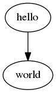

# hello bot

プログラムを実行して結果を返す。 [Mastodon](https://github.com/tootsuite/mastodon) チャットボットです。

## 使い方

### 基本

__[@hello@mastodon.toycode.com](https://mastodon.toycode.com/@hello) に話しかけ(メンション)して下さい。__


送信
```
@hello@mastodon.toycode.com
hello.cpp
#include <iostream>
int main()
{
    std::cout << "Hello, World!\n";
}
```

返信
```
Hello, World!
```

__@hello@mastodon.toycode.com の次はファイル名です、拡張子によって言語を判定します。__

```
@hello@mastodon.toycode.com
(write "hello, world")
(newline)
```

```
@hello@mastodon.toycode.com
hello.rb
puts "hello, world"
```

__ファイル名の代わりに　[shebang](https://ja.wikipedia.org/wiki/%E3%82%B7%E3%83%90%E3%83%B3_(Unix)) を使う事もできます。__

```
@hello@mastodon.toycode.com
#!/bin/bash
echo "hello, world"
```

### 画像生成

`SVG (*.svg)`, `Dot言語 (*.dot)`, `HTML (*.htm|*html)`, `Gnuplot(*.plt|*.gnuplot|*.gpi)` に対しては画像を生成して返します。

送信
```
@hello@mastodon.toycode.com
hello.cpp
#include <iostream>
int main()
{
    std::cout << "Hello, World!\n";
}
```
返信




また、プログラムによって `out.svg` `out.png` というイメージファイルを作成すると。 `out.svg` は `png` に変換して、 `out.png` はそのままそれを返します。

送信
```
@hello@mastodon.toycode.com
rgb-tile.c
#include <stdio.h>

void main()
{
  int x, y, n=0;
  char *c[] = {"#e55", "#5e5", "#55e"};
  FILE *fp = fopen("out.svg", "w");

  fprintf(fp, "<svg height='200' width='400'>");
  for(x=0; x<400; x+=10) {
    for(y=0; y<200; y+=10) {
      fprintf(fp, "<rect x='%d' y='%d' width='10' height='10' fill='%s' />\n", x, y,  c[n++%3]);
    }
  }
  fprintf(fp, "</svg>");
}
```

返信


## 対応している拡張子とプログラム処理系

|拡張子     |処理系&言語      |
|:---:     |:---:            |
|.asm      | NASM            |
|.bc       | bc              |
|.bf       | beef(Brainfuck) |
|.cpp      | clang++(c++)    |
|.cs       | mcs/mono(C#)    |
|.c        | gcc(C)          |
|.dot      | dot/Graphviz    |
|.f .f90 .f95| gfortran    |
|.go       | go              |
|.hs       | ghc             |
|.html     | phantomjs       |
| java     | openjdk-9       |
|.js      | nodejs          |
|.lsp .lisp | clisp          |
|.lua     | lua5.3         |
|.ml      | ocaml          |
|.php     | php7           |
|.plt .gnuplot .gpi | gnuplot |
|.py2     | python2        |
|.py3 .py | python3         |
|.pl      | perl            |
|.rb      | ruby            |
|.scm     | guile(scheme)   |
|.sh .bash| bash            |
|.sql     | sqlite3         |
|.svg     | inkscape        |
|.ts      | tsc(TypeScript) |
|.vim     | vim             |
|.zsh     | zsh             |

## リンク

* [hello bot のソースリポジトリ](https://github.com/HiroshiOkada/hello-bot)
* [hello bot で使用している Docker イメージのリボジトリ](https://github.com/HiroshiOkada/bot-playground)
* [岡田洋(作者)](http://hiroshi.toycode.com/)

